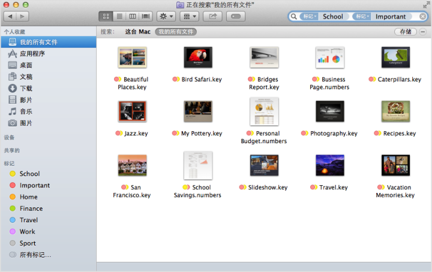
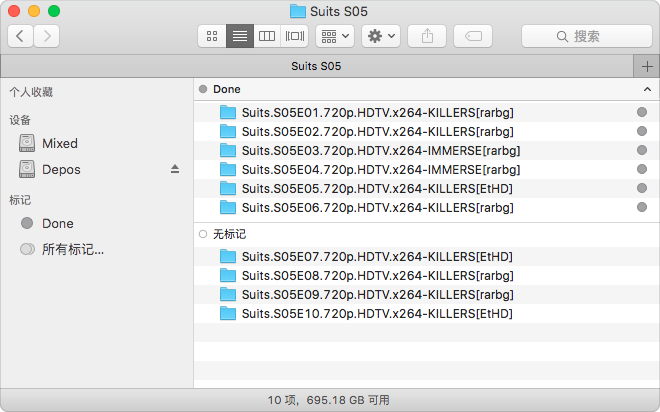
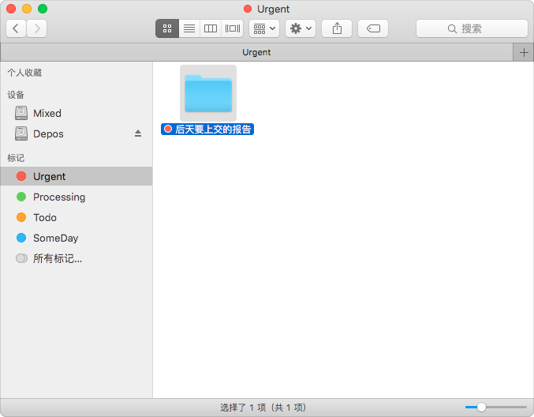
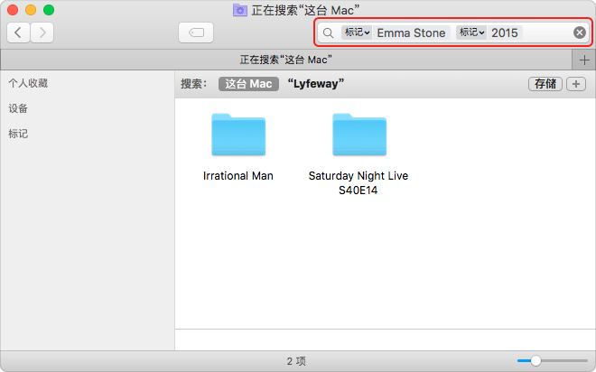
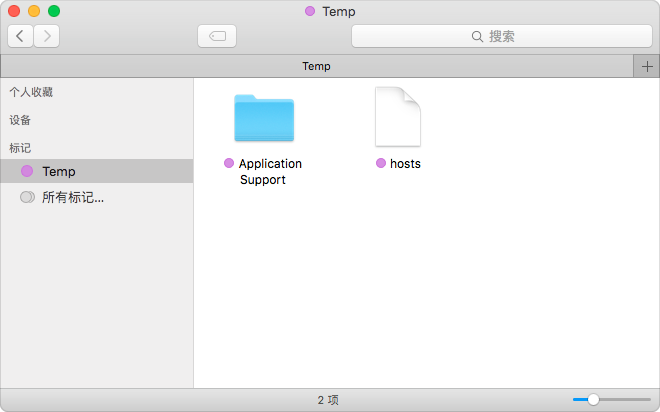
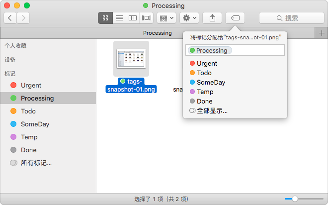
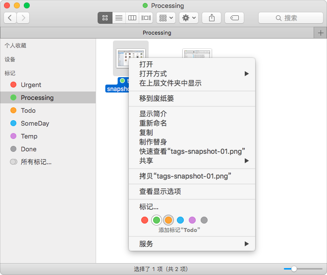
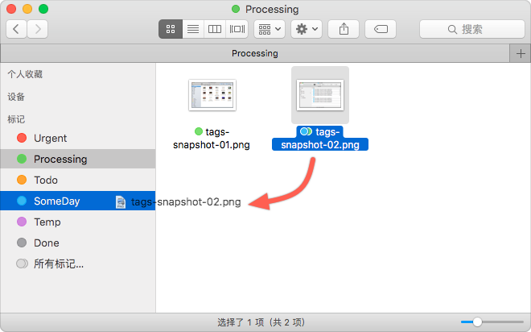
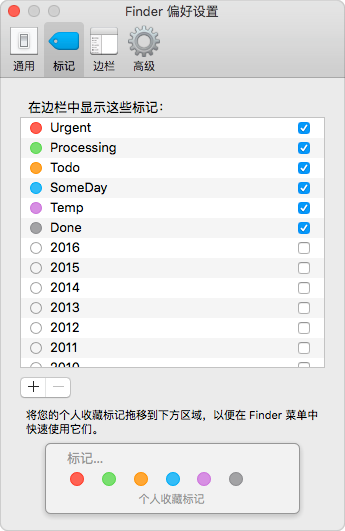

  如果高效地整理电脑中的文件，是每个人都需要面对和思考的问题。大到把硬盘分几个
  区，并分别给它们命名，小到一个文件或文件夹的名称，甚至删除一个文件，其实都是
  在整理文件。

  而整理文件的目的又是什么？随着文件数量年复一年的增长，为了日后可以更方便快捷
  不用太多思考的找到所需要的文件。在Windows 中，Everything 或 Listary 快速全局
  检索文件名；OS X 有 Spotlight 和 Alfred 。

  OS X Finder中的标记（Tags）功能，是在文件夹分类和文件名的基础上，提供全新维度
  的文件整理和处理机制，在WWDC 2013 上做为 OS X 10.9 Mavericks 的 10 大新功能一
  同发布。

# 关于标记的重要知识

  1. 标记信息存储位置。如同文件或文件夹的注释功能一样，标记信息存储在文件的扩展
     属性（ Extended Attributes） 里。也就是说，标记信息是文件或文件夹的一部分
     信息，如果文件移动或复制到另一台 Mac 上，标记信息也随文件或文件夹一同复制
     。
  2. 修改或删除标记。修改或删除一个标记，被该标记所标记的文件的对应标记信息也一
     并修改或清除，修改可以撤销，删除无法撤销。
  3. 标记颜色。标记只提供七种颜色，每个标记可以选择一种颜色，或者不显示颜色。不
     同标记可以显示同一种颜色。
  4. 标记名称。标记只通过标记名称做为检索文件的唯一条件。
  5. iCloud 同步标记列表。iCloud 同步标记本身的所有信息，包括标记名称、标记颜色
     。甚至 Finder 边栏的标记列表的顺序、数量都通过 iCloud 同步，你个人的所有
     Macs 的 Finder 边栏的标记显示效果是一模一样的。
  6. 标记在文件或文件夹得显示。只有种颜色的标记会在文件或文件夹的名称前面显示相
     应颜色的标记圆点。
  7. 有效标记的文件位置。以下位置的文件或文件夹都可以通过标记被筛选出来：
    - iCloud Drive
    - 内置磁盘
    - 通过 USB 连接的外置磁盘（包括移动硬盘和 U 盘）
    - 通过 Finder 网络加载的共享磁盘

# 官方演示

  

  官方演示的用法，充分利用了标记可以穿透文件夹和不同磁盘的限制，集中显示在标记
  中。好处是，简单直接高效，不管是在 iCloud Drive 里的文件、U 盘还是其他 Macs
  上共享的文件，全部现在标记的结果里。

  但这种用法随时间的推移，最后的结果是，每一个标记都包含大量的文件。结果中的文
  件的位置信息无法清晰的展现。

# 推荐用法一：单独使用一个颜色做为「辅助标记 flag」

  

  比如，在很长的时间跨度中，看一部美剧，标记观看的进度。

# 推荐用法二：基于标记的 GTD

  

# 推荐用法三：细分无法用文件夹归类的海量文件

  

# 推荐用法四：临时标记未被 Spotlight 索引的文件或文件夹

  

  Spotlight 并不索引系统文件，以及用户文件夹 /Users/username/Library，使用一个
  临时标记替代 Finder 边栏中的「个人收藏」以保持「个人收藏」的整洁。

# 标记的相关操作

  

  

  

  

