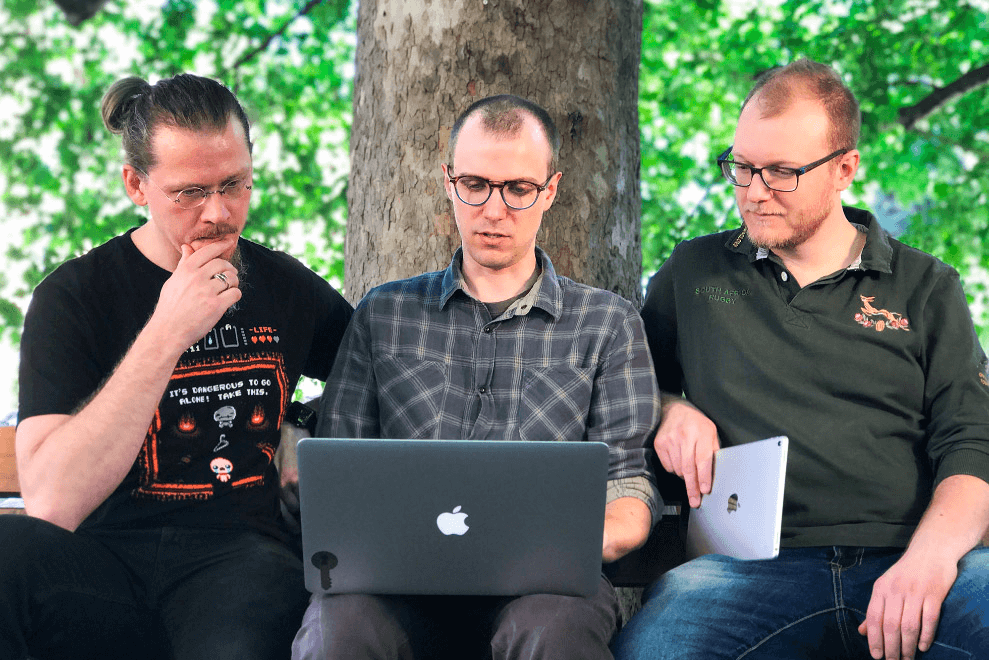
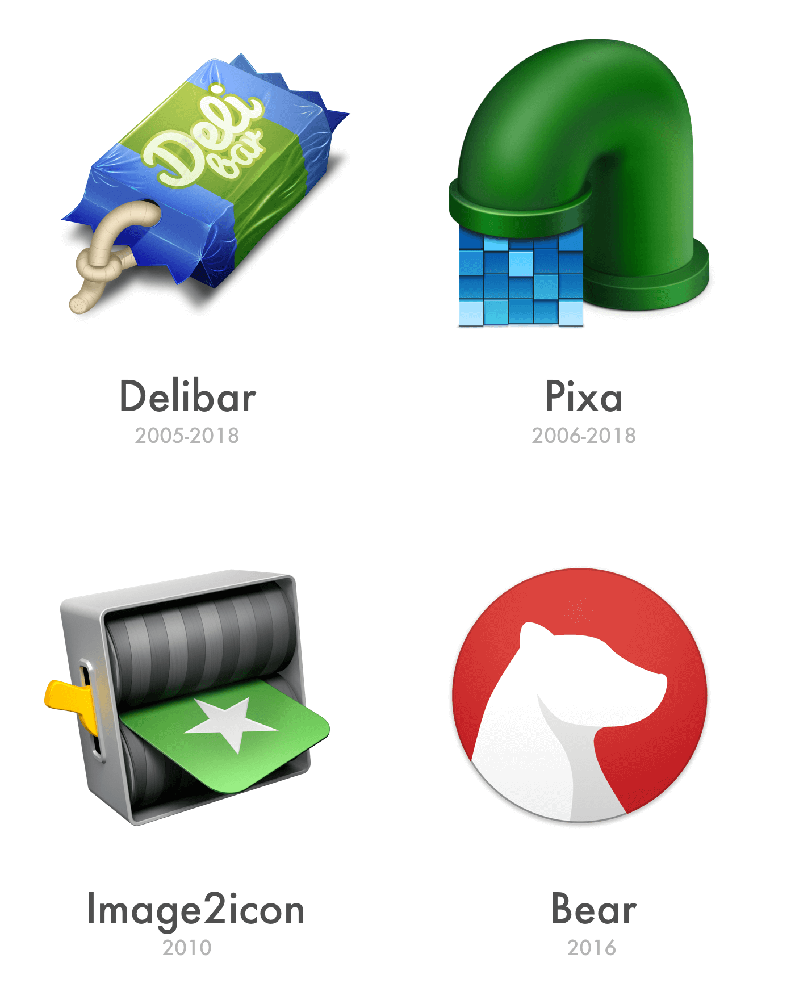
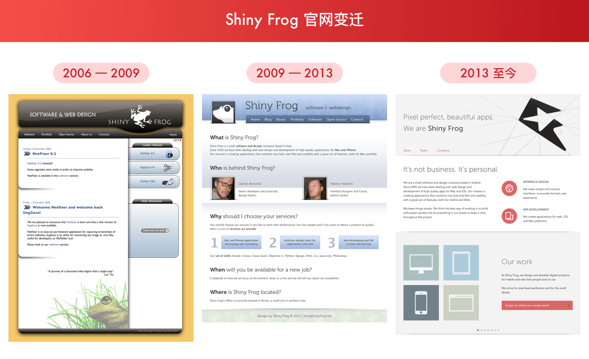
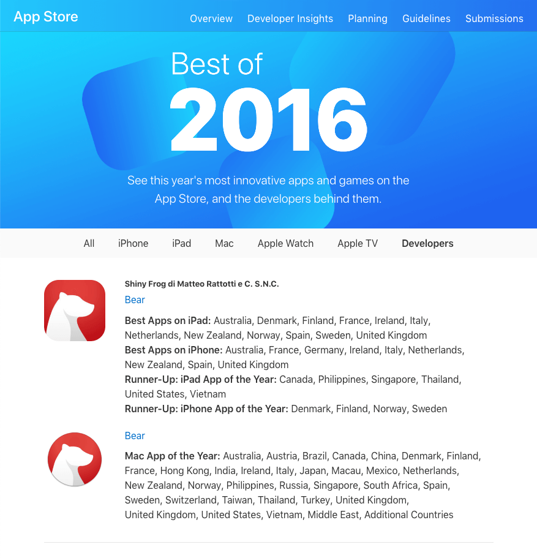
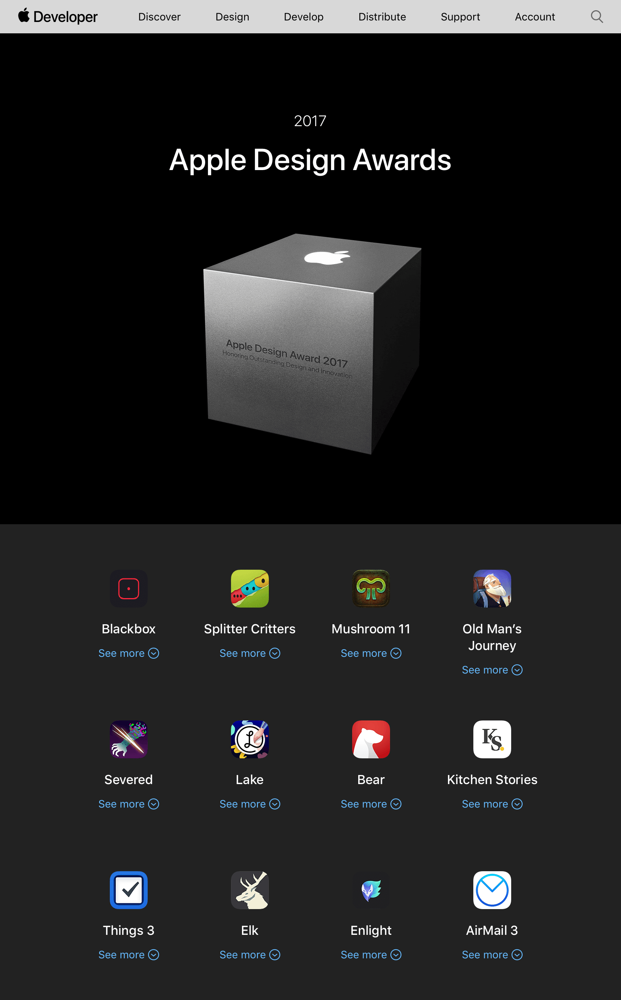

# Shiny Frog 是一家怎样的公司？

> Pixel perfect, beautiful apps. —— We are *Shiny Frog*
> A journey of thousand miles begins with a single step. —— Laozi
> It’s not business. It’s personal.

Shiny Frog 是一家 2005 年成立于意大利的三人独立软件公司，专注于 web、 Mac 和
iOS 应用的开发。公司注册名称 Shiny Frog Di Matteo Rattotti & C. S.N.C.，Di 是成
员之一 [Danilo Bonardi](http://instagram.com/trix180) 的缩写；接下来的是
[Matteo Rattotti](http://twitter.com/matteorattotti)。另外一位成员 [Giordano
Fracasso](http://www.giordanofracasso.com/) 大约在 2009 年前后离开。根据官网的
修改历史记录， [Konstantin Erokhin](http://twitter.com/nerolapis) 大约在 2012 -
2013 之间加入至今。

2017 年 8 月 16 日 Shiny Frog 在爱尔兰都柏林注册 SHINY FROG LIMITED。Shiny Frog
官网在 2018 年 6 月底将办公地址从原来自 2009 年开始使用的 [Via Campioni 6,
43100 Parma,
Italy](https://www.google.com/maps/place/Via+Inigo+Campioni,+6,+43125+Parma+PR,+Italy/@44.7849792,10.3206772,17z/data=!3m1!4b1!4m5!3m4!1s0x47806b177d63ca31:0x1cc39bd9d8347408!8m2!3d44.7849754!4d10.3228659)
变更为 [Dublin, 60-63 Dawson St Dublin 2,
Ireland](https://goo.gl/maps/1pCqmgCyWx22)。而在 2009 年之前，在官网的 vCard 中
显示的地址为 [Via Olimpia 11, 43100 Parma Emilia Romagna,
Italy](https://www.google.com/maps/place/Via+Olimpia,+11,+43124+Parma+PR,+Italy/@44.77411,10.3076622,17z/data=!3m1!4b1!4m5!3m4!1s0x47806b727d47ebe5:0x2d70c8106808553d!8m2!3d44.77411!4d10.3097532)
。在 Parma, Italy 的两个地址仅有 5 分钟的车程。

Shiny Frog 主要工作分两部分：一是接受客户委托，设计开发网站和小型 Web 应用。早
期的客户有 [EDM Studio](https://www.edmstudio.com)、[Infomobility
Parma](http://www.infomobility.pr.it) 和当地的大学 [University of
Parma](https://www.unipr.it) 等。二是自己开发应用，主要有四款 Mac 上工具类应用
：[Delibar](http://www.delibarapp.com/)、[Pixa](http://www.pixa-app.com/)、
[Image2icon](http://www.img2icnsapp.com/)、和 [Bear](https://bear.app)。

Delibar 是 Delicious 和 Pinboard 在 Mac 平台上的客户端；Pixa 是支持多种格式的图
片收集管理工具。Shiny Frog 已经决定在 2018 年底结束对这两款工具的支持 [About
Retiring Delibar and Pixa](http://www.shinyfrog.net/delibar_pixa.html)。

[Image2icon](http://www.img2icnsapp.com/) 是一款操作简洁功能丰富的图标图像格式转换工具，他还有一个非常高效地更换 macOS 文件夹的样式。

Shiny Frog 的重要视觉设计工作主要是通过外包给专业设计师去完成。Shiny Frog 现在
的 logo 是 [Gert van Duinen -
Dribbble](https://dribbble.com/shots/1215145-Shiny-Frog-Logo-Brand-Mark-Design)
设计；Pixa 的 logo 是由 [Pixa Icon By Cuberto -
Dribbble](https://dribbble.com/shots/488388-Pixa-Icon) 制作等。但 Bear 的设计工
作和以往不同，是完全由 Shiny Frog 团队设计制作。容易让人误解的是 dribbble 上的
一个 shot [Bear by Fabio Basile -
Dribbble](https://dribbble.com/shots/2809380-Bear) ，误以为 Bear 是由 Fabio
Basile 设计，但[Fabio Basile 在自己的 shot 的评论中
](https://dribbble.com/shots/2809380-Bear#comment-5391261) 也承认 Bear 的设计工
作是 Shiny Frog 团队完成的。

Shiny Frog 的官网在 10 多年来，只经历了三次改版：

有意思的是，在第一版的网站底部有一句老子的话：「A journey of thousand miles
begins with a single step.」，意思是「千里之行，始于足下。」

# Bear 的获奖情况

在 App store 上线一个月后，Bear 收获了 2016 年度 App Store 的 Best Apps on
iPhone/iPad、Mac App of the Year。

Bear 在 2017 年更是获得了苹果设计大奖，对于 iOS & macOS 应用开发者来说，这应该
就是奥斯卡大奖。

# Bear 的新功能计划

Bear Web 已经是在开发中，而呼声最高的应该支持表格功能，也是在计划清单中。

Bear 的 Web 版本的笔记同步依然是依赖 iCloud，WWDC 2015 发布的 CloudKit JS 支持
在网页中访问 iCloud 中的数据。

要在 markdown 编辑器实现一个基础表格的功能，不是一个简单的事情，交互确实有其复
杂性。期待可以更早看到 Bear 的表格编辑出彩的地方。

# 参考链接

  1. http://shinyfrog.net
  2. https://bear.app
  3. https://blog.bear-writer.com
  4. https://vimeo.com/192615466
  5. https://itunes.apple.com/us/app/bear/id1091189122?mt=12
