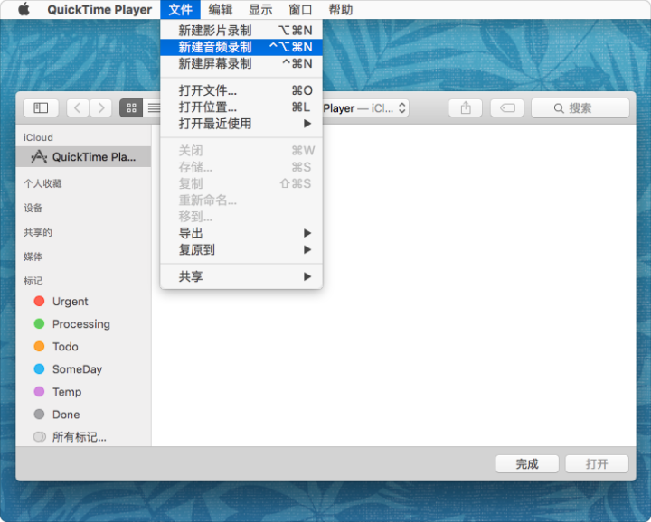
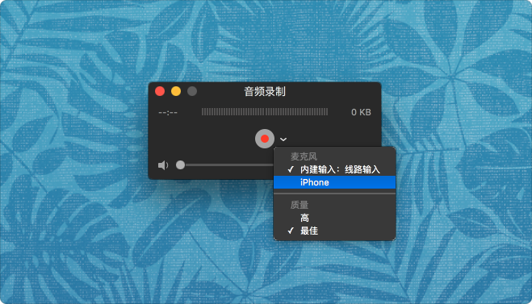
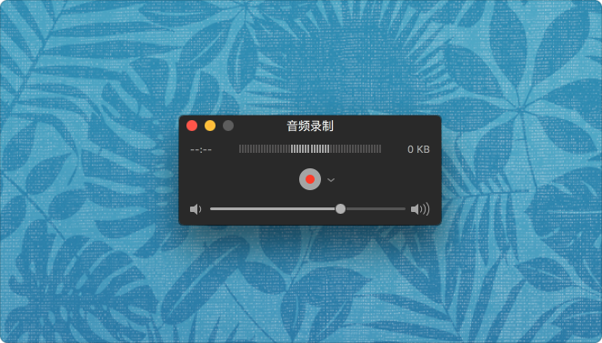

> 本文首发于少数派「一日一技」专栏：http://sspai.com/34500, 略有改动。

# 导读

  为了适应不同的场景，实现同一目的，通常会采取不同的策略。iPhone 的声音传送到音响
  播放，根据设备的不同，大致有如下方法：

  1. 3.5mm 耳机接口
  2. 蓝牙连接
  3. AirPlay
  4. Lightning 数据线

   3.5mm 耳机接口和蓝牙连接都非常普遍，就不再赘述。AirPlay 是指 Apple 在 2010年
   发布的无线流播放技术。目前 Apple 设备可提供AirPlay 功能的有 AirDrop 和Apple
   TV。部分品牌音响和许多国产盒子也已经支持提供 AirPlay 功能。也可通过三方如
   AirServer 或 Air Playit 等软件支持提供AirPlay，但效果和稳定程度没有保证。

  接下来，详解通过 Lightning 数据线的方式，在 Mac 上接收并播放 iPhone 的声音。

# 操作方法

  1. 将 iPhone 通过 Lightning 数据线与 Mac 相连接
  2. 打开 QuickTime Player
  3. 菜单栏中选择「文件」-> 新建音频录制，快捷键为 control + option + command + n，出现「音频录制」的小窗口

  

  4. 在录制按钮的右侧，点开向下的箭头，在「麦克风」的列表中，选中连接的 iPhone

  

  5. 向右拖动「音频录制」窗口底部的音量控制的小圆点
  6. 在 iPhone 上播放声音

  

# 使用场景

  无 WiFi 或 AirPlay 环境下，需要高稳定性公共场合，参考 Apple 的产品发布会；
  家中无蓝牙支持，一根数据线边充电边播放音频节目。
