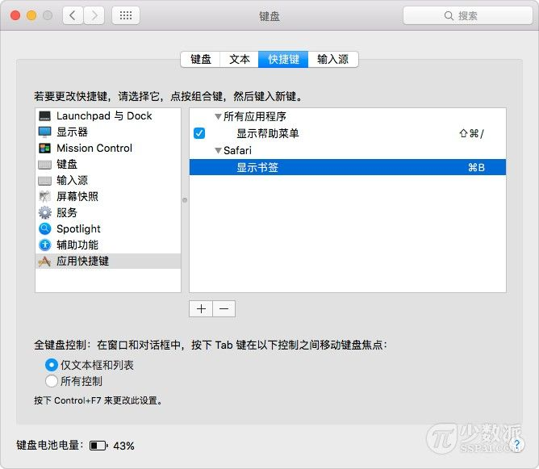

> 本文首发于少数派「一日一技」专栏：http://sspai.com/34527, 略有改动。

## 为什么要自定义快捷键

  1. 因为不习惯，需要修改应用默认的快捷键
  2. 菜单没有对应的快捷键

  可能很多人都不知道，通过 Mac OS X 系统内置的「应用快捷键」功能，我们可以为那
  些本来没有快捷键的菜单命令，自由设置快捷键。

## 设置步骤

  Mac OS X 强大的「应用快捷键」功能，可以在任意 OS X 应用（包括 Finder）中为每
  一个菜单命令创建快捷键。这将自定义快捷键功能完全开放给用户。

  「应用快捷键」是通过建立菜单命令的名称与快捷键的一一对应关系机制，使得在操作
  系统层面绑定快捷键显得非常的简单。

  以为 Safari 「显示 / 隐藏书签」菜单命令绑定 Command + B 快捷键为例。Safari 的
  「显示 / 隐藏书签」默认没有绑定快捷键。

  

  在「系统偏好设置」-> 「键盘」-> 「快捷键」设置页面，在左边栏列表中，选中「应
  用快捷键」。

  

  点击「+」，弹出新建一个菜单命令快捷键窗口。

  1. 「应用程序」选择 Safari
  2. 「菜单标题」填入「显示书签」4 个字，注意输入框下面的小字提示：「请输入您要
     添加的菜单命令的准确名称」
  3. 「键盘快捷键」处，选中输入框之后，同时按下 Command + B，输入框会记录您刚才
     按下的快捷键

  

  

  完成添加快捷键后，不需要 Safari 重启，「显示书签」菜单命令出现了快捷键提示，
  说明添加成功。

  

  同样的步骤，再新建一个快捷键，为 Safari 在显示书签的状态下，隐藏书签只要在「
  菜单标题」填入「隐藏书签」4 个字，键盘快捷键同样为 Command + B。

  以上步骤就完成了为 Safari 绑定「显示 / 隐藏书签」的 Command + B 快捷键。即可通
  过 Command + B 在 Safari 边栏显示和隐藏书签列表。

## 注意事项

  1. 新建的快捷键已经被其他菜单命令使用，新建的快捷键无效
  2. 菜单命令已有的快捷键，可通过新建新的快捷键修改
  3. 「菜单标题」的准确名称包括标点符号的所有字符，其中 「>」 字符输入 「->」，
     省略号键入不含空格的三个句点或者按下 Option + ;
  4. 系统的首选语言若变更后，菜单标题若有变化，需修改「应用快捷键」中的标题名称

