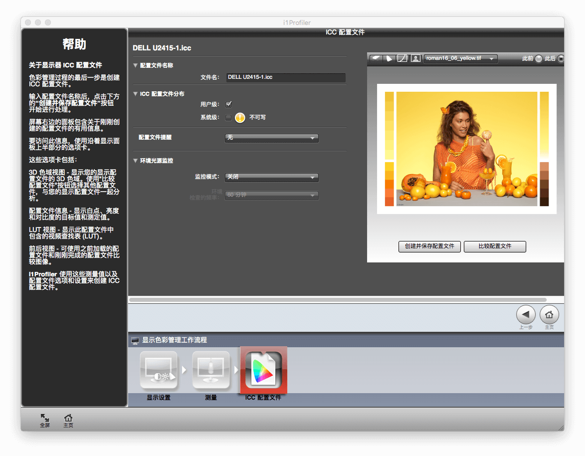

## 色彩校正原理

  i1 Display Pro 通过光学系统直接采集显示器所发射出来的光线，配套的色彩管理软件
  与操作系统交互调整到最合适的参数。

## 硬件设备

  1. 校色仪：i1 Display Pro
  2. 主机：Mac Mini、MacBook Air
  3. 显示器：DELL U2415、DELL U2412M、MacBook Air

  

## 软件支持

  1. OS X El Capitan 10.11.5
  2. i1Profiler

## 软件安装

  根据 i1Profiler 傻瓜式安装向导，下一步、同意、下一步，直到安装完成。

  

  打开 i1 Profiler，使用 USB 接口接上 i1 Display Pro，前期工作已准备就绪。在左
  侧边栏列有四个工作流程，分别是「显示器色彩管理」、「投影仪色彩管理」、「打印
  机色彩管理」、「扫描仪配置文件」，i1 Display Pro 支持前两个工作流程，不支持的
  后两个功能 i1Profiler 用 「DEMO」标识出来。

  

  在主界面的「用户模式」一栏，有基本和高级选项。切换到高级，每一个工作流程都会
  有更多的子功能被显示出来，基本的用户模式的四个工作流程变成了对应工作流程的第
  一个子功能。接下类的校色步骤，就从显示器的「色彩管理」、「品质检验」、「均匀
  度」三个子功能来进行。

  

## 具体操作

  在主界面的底部，分别有三个步骤：「显示设置」、「测量」和「ICC 配置文件」。

### 显示设置

  

  1. 选择目标显示器：点击显示器的图标，选在要测量的目标显示器，此时 i1Profiler
     会将本窗口移动到目标显示器中显示。
  2. 目标显示器的技术类型：不依靠 i1Profiler 的自动检测结果，根据显示器参数确认
     后选择。
  3. 白点：即色温。除非印刷行业选择「CIE 光源 D55」，否则应该选择 D65 或 D75。
     我选择 D65，看起来白得纯粹一点。
  4. 亮度：160 cd/m2。这个亮度大约是显示器最大亮度的 40%。
  5. 伽玛：网页设计用途，选择 sRGB。
  6. 点击下一步，进入「测量」。

### 测量

  显示器硬件设置：无法通过键盘调整亮度的显示器，选择「手动调整亮度、对比度和RGB
  增益，MacBook Air 选择「自动显示器控制（ADC）」

  

  点击「开始测量」进入测量模式，根据屏幕上的显示，将 i1 Display Pro 悬挂在屏幕
  中央，按照显示步骤进行，该步骤大约 3 分钟。期间 i1Profiler 显示不同颜色和不同
  亮度，供 i1 Display Pro 采集显示信息。

    

### ICC 配置文件

  命名配置文件名称，点击「创建并保存配置文件」。此时，主界面右侧会有随机图片可
  供测量前后的显示效果对比。

   

  备份 ICC 文件：OS X 系统偏好设置 -> 显示器 -> 颜色，在「显示描述文件」列表中
  ，找到在上一步骤所生成的配置文件，点击右侧的「打开描述文件」，系统将调用
  ColorSync 查看 ICC 配置文件，通过菜单栏文件中的「存储为…」选择其他位置保存ICC
  文件。

   

## 均匀度

  均匀度是指对显示器针对同一色彩，不同区域的显示结果的差异。

  

## 校色效果

  

