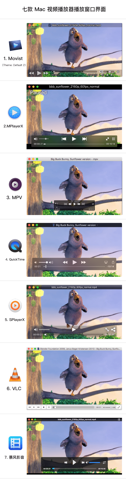
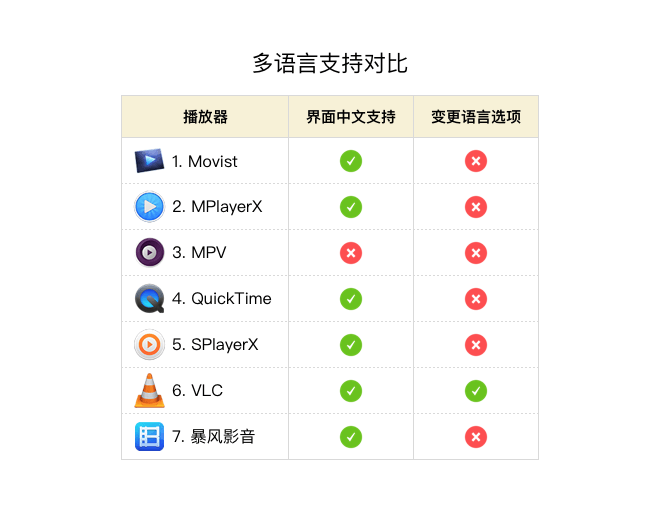
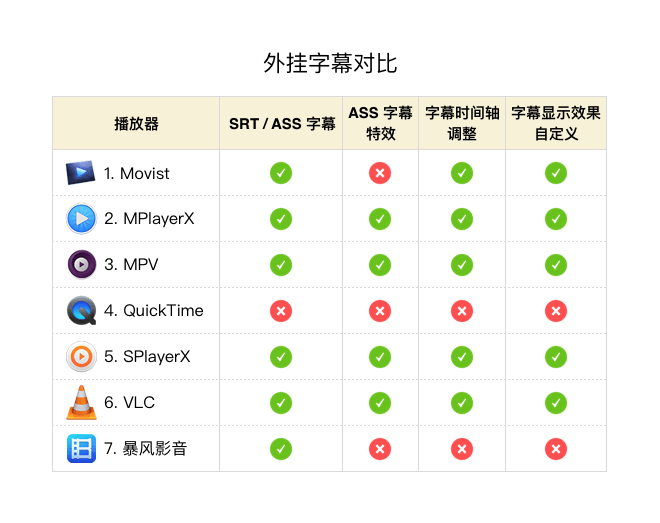
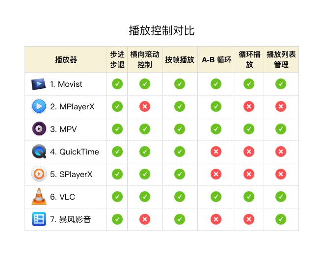
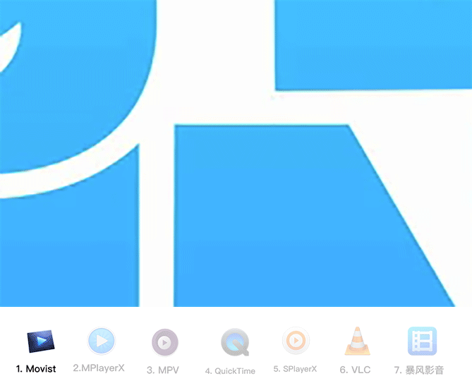
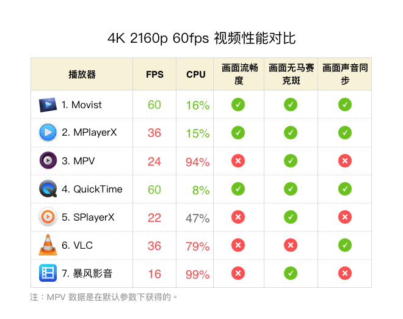
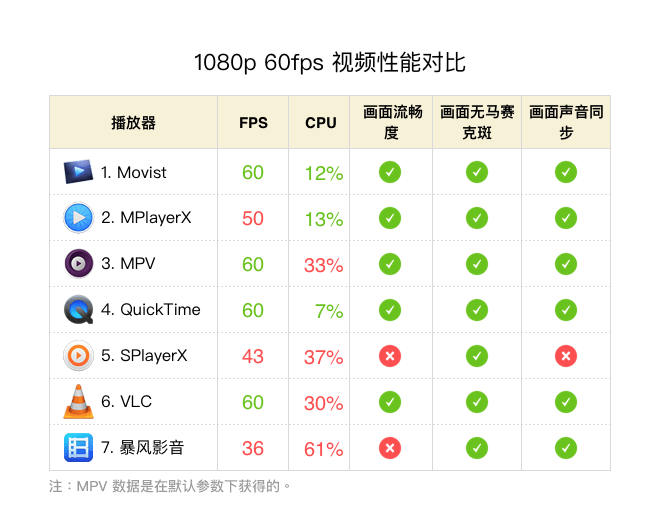
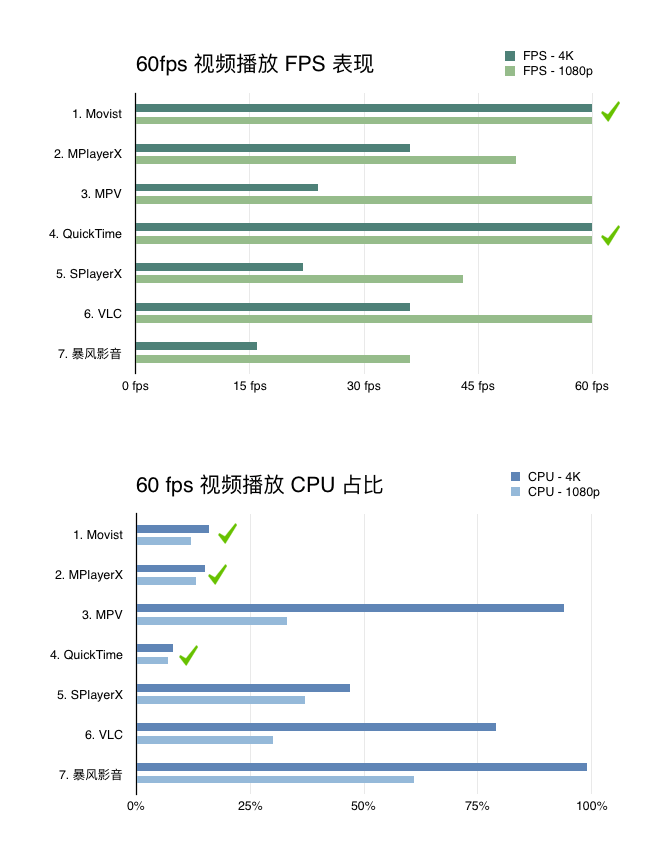
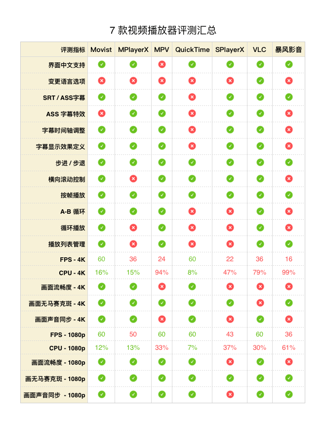

> 本文还发布在：
  >
  > 1. 知乎专栏：https://zhuanlan.zhihu.com/p/21499184
  > 2. 爱范儿：https://www.ifanr.com/app/680902

  根据播放器名称排序，下文的具体评测也是以此为先后顺序。MPlayer extended 在 2013
  年后没有再更新，遂剔除。Kodi 和 Plex 侧重于建立多媒体中心，以及多设备播放的功能
  ，不在本次评测之列。

  其中 MPlayerX、SPlayerX 和暴风影音为国人出品。MPlayerX 在 Mac App Store 的娱乐
  类排行榜稳居前三；中国付费榜 MPlayerX 和 SPlayerX 分别在第一和第三的位置（
  2016-07-03），美区付费榜 MPlayerX 当前（2016-07-03）为第 18 名。除 QuickTime 为
  OS X 内置以外，在主流视频播放器中，不管是从数量还是市场份额上看，说国产视频播放
  器在 Mac 平台已占据「半壁江山」并不为过。但后面的评测，SPlayerX 和暴风影音有较
  大的提升空间。

  本次主要从以下方面进行评测：

  用户界面
  外挂字幕
  播放控制
  画面质量
  播放性能
  视频格式
  价格

  最后根据日常需求，给出选择建议。

## 用户界面

  七款播放器的播放播放界面基本一致。

  标题栏都显示视频文件的相关信息，Movist、MPlayerX、SPlayerX 和暴风影音都显示文件
  名称，MPV 和 QuickTime 显示视频标题，VLC 显示视频作者 + 标题。

  除 VLC 的播放控件是固定在视频画面底部（皮肤有「明亮」和「深色」两种颜色），其余
  的播放控件均是叠加并可浮动在视频画面之上。

  Movist 还提供了 4 款主题可供选择。

  

## 中文支持

  MPV 无多语言支持（MPV 需用命令行启动）。用户界面的语言均随从 OS X 系统语言，
  其中仅 VLC 提供了变更语言的选项。

  

## 外挂字幕

  QuickTime 不支持任何外挂字幕（但可以显示视频文件内嵌字幕）。

  Movist 和暴风影音可以处理 ass 字幕文件，但无法呈现特效，仅在普通字幕的位置显
  示特效中的文本信息。

  暴风影音和 QuickTime 无法调节字幕时间轴，除此外，其余均可通过调整提前或延时显
  示字幕。

  字幕显示效果的自定义功能，Movist 可定义的内容最为人性化（字体、大小、颜色、外
  轮廓、阴影、水平位置、垂直位置、对齐、3D 效果等），同时调整画面的垂直位置，在
  底部预留出更多的黑边用来字幕的显示。SPlayerX 的自定义功能最为简陋。

  

## 播放控制

  步进 / 步退是指根据用户控制（主要指键盘快捷键），按照固定时间间隔向前 / 向后跳
  跃播放。Movist 步进 / 步退功能最丰富，除了提供 10 秒、60 秒和 300 秒的不同间隔
  外，还支持这三种时间间隔的自定义。

  横向滚动（Magic Mouse 单指和触控板双指的左右滑动）控制，只有 Movist 和
  QuickTime 按帧播放，Movist 还支持把横向滚动自定义为帧、时间间隔和切换字幕。其
  余为按 1 秒的时长跳跃播放。该功能按帧播放较为自然。

  按帧浏览对于精确截图或仔细研究画面是一个不可或缺的功能。七款播放器均支持。VLC
  可查看下一帧，但无法浏览上一帧画面。

  循环播放在日常使用中较少出现，但对于一些特殊场合，比如某些营业场所（咖啡店，
  服装店等），各种会议在正式开始前的一段时间，循环播放视频较为常见。加上播放列
  表的管理，可以实现多个视频文件的轮流循环播放。

  

## 画面质量

  色彩方面的简单对比，使用 [Big Buck Bunny 1080p
  60fps](http://bbb3d.renderfarming.net/download.html) （视频编码为 H264 -
  MPGE-4 AVC part 10 avc1）从最开始的第 10 帧画面，显示器为 DELL UltraSharp
  U2415。这帧画面带有大块的渐变蓝和几何线条，更容易通过肉眼鉴别出差异（该对比并
  不代表播放器在其他色彩方面以及不同编码的视频的表现结果） 。

  第一组 MPlayerX、MPV 和 VLC 色彩表现几乎完全一致，第二组 Movist、SPlayerX 与
  暴风影音 的色彩几乎相同，QuickTime 的表现与其他的结果都存在肉眼可见的差异。这
  跟播放器所采用的视频解码器有关。

  在我的显示器上观察，第一组的色彩过渡比第二组显得更自然。

  

  细节方面，使用 1080p 的画面截图，选取如下区域，放大 300% 后进行对比。结果第一
  组略优于第二组。第一组中的各自表现基本一致，第二组中只有 SPlayerX 出现两处较
  大的锯齿。

  

## 播放性能

  播放设备
  型号：MacBook Air 11-inch
  处理器：1.4 GHz Intel Core i5
  显卡：Intel HD Graphics 5000 1536MB
  显示器：DELL UltraSharp U2415

  系统监视应用
  istat menus 5.11 (629)

  视频文件 [4K Big Buck Bunny 2160p
  60fps](http://bbb3d.renderfarming.net/download.html)（分辨率为 3840x2160，视
  频编码为 H264 - MPGE-4 AVC part 10 avc1）

  QuickTime 表现非常出众，Movist 在 CPU 方面略高于 QuickTime，但也在可接受范围
  ，其他的表现也是非常优秀。除此之外，其余五款播放器在 FPS（frames per second，
  每秒的播放帧数）的表现都不及格，只有 MPlayerX 在流畅度上差强人意。MPV、
  SPlayerX 和暴风影音画面与声音完全不同步。

  

  MPV 在命令行出现如下提示：

  > Audio/Video desynchronisation detected! Possible reasons include too slow
  > hardware, temporary CPU spikes, broken drivers, and broken files.

  在本文评论区中，多位知友友情指出，MPV 可通过 --vo 等参数设置不同的视频解码器。
  本文是在性能环节，MPV 仅在无额外设置的情况下获得的性能数据。

  > 删除以下之前的表述：
  > 虽然 MPV 仅仅能通过命令行播放，同时需要完全手动配置参数，极客对此爱不释手。在
  > 测试性能之前，我曾是对 MPV 寄以厚望。

  1080p 视频测试

  视频文件：Big Buck Bunny 1080p 60fps（分辨率为 1920x1080，视频编码为 H264 -
  MPGE-4 AVC part 10 avc1）

  如果说使用 4K 的视频文件测试略显极端，接下来使用较为常见的 1080p 分辨率的视频
  进行对比。

  

  结果显示 MPlayerX、SPlayerX 和 暴风影音都没能达到每秒 60 帧，暴风影音 CPU 占
  用最高，SPlayerX 表现最差，画面流畅度不足，且画面声音出现不同步。

  

  

## 视频格式支持

  QuickTime 支持视频格式有 AVI（.avi）、DV Stream（.dv）、MPEG-2（.mpv、.mpg …
  ）、MPEG-4（.mp4, .m4a, .m4p, .m4b, .m4r and .m4v）、QuickTime Movie（.mov）
  ，但不支持当前最流行的开源社区视频格式 .mkv。

  除 QuickTime 外，其余均支持当前主流文件格式，如 .mp4、.mkv、.avi、.flv 等。

## 价格

  

## 综合选择建议

  相比之下，如果价格不算缺点，Movist 仅有 ass 字幕的无法表现特效这一个缺点。
  MPlayerX 曾经和臭名昭著的 MacKeeper 与 ZipCloud 捆绑销售（可选）（关于捆绑销售
  的网页链接：链接 1，链接 2），且不通过 Mac App Store 升级，安装前请须知。目前
  （2016-07-05）从 MPlayerX 官网下载的安装包中，安装过程未出现捆绑销售的步骤，安
  装后，也未发现有被安装其他应用的情况。

  结论：

  ￥30 元的 Movist 是一款功能丰富、性能卓越的播放器，综合表现最为优秀，优先考虑
  ；MPlayerX 和 VLC 可以满足日常使用 1080p 及以下的视频；如果对 MPV 感兴趣，MPV
  提供了 403 个参数可供配置，包括制定视频和音频的解码器等等，可以忽略性能环节的
  结果；SPlayerX 和暴风影音表现垫底，不建议选择。

  

