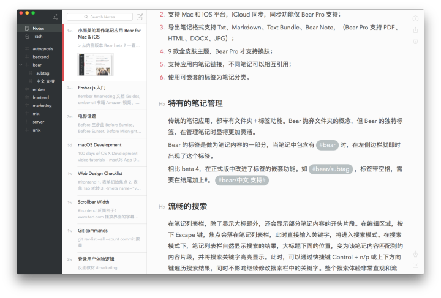
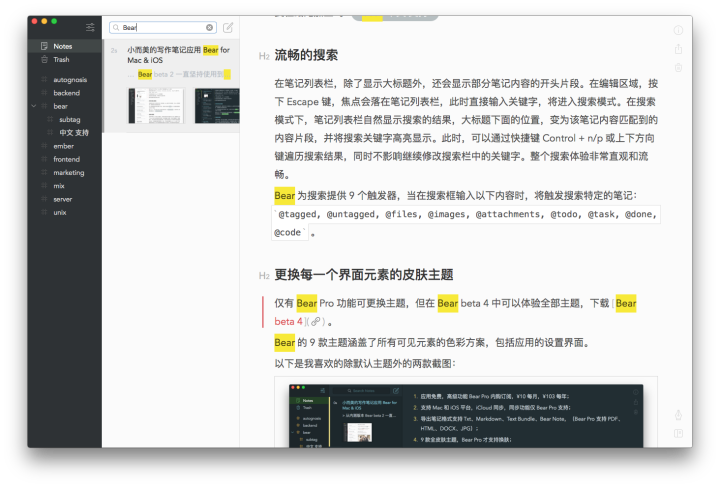
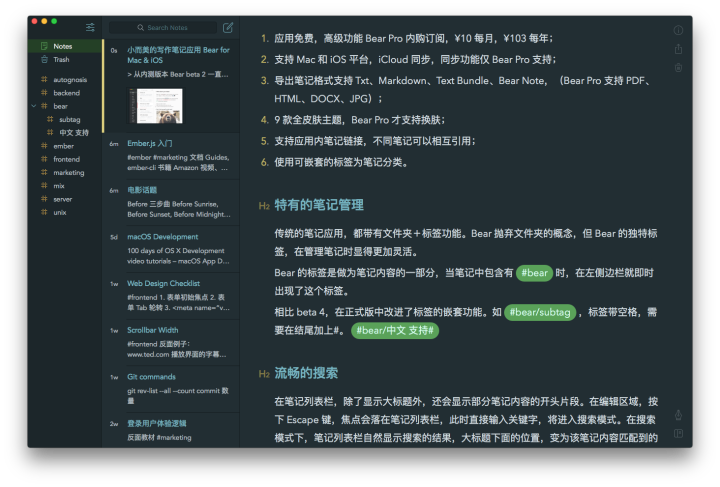
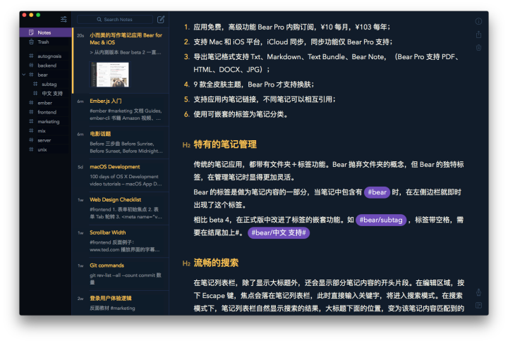

  从内测版本 Bear beta 2 一直坚持使用到 beta 4。和同类应用相比，几乎没有新的功能
  。但所有的功能细节都认真打磨过。其中最打动我的是 Bear 的 Markdown 编辑器。11 月
  3 日登录 Mac App Store 就被列入「编辑选荐」。

  

## 功能罗列

  1. 应用免费，高级功能 Bear Pro 内购通过 App Store 订阅，¥10／每月，¥103／每年
     ；
  2. 支持 Mac 和 iOS 平台，iCloud 同步。同步功能仅 Bear Pro 支持；
  3. 导出笔记格式支持 Txt、Markdown、Text Bundle、Bear Note，（Bear Pro 支持
     PDF、HTML、DOCX、JPG）；
  4. 9 款全皮肤主题，Bear Pro 支持换肤；
  5. 支持应用内笔记链接，不同笔记可以相互引用；
  6. 使用可嵌套的标签为笔记分类。

## 可能是最好用的 Markdown 编辑器

  Mac 平台可编辑 Markdown 的应用众多，带笔记管理的有 Ulysses 、 MWeb 、 Textnut
  和 Quiver ， 有道笔记 ，仅编辑功能的有 Typora 、 Byword 、 Mou 、 Typed 和
  Marked 。排名根据个人喜好。3 个月前，第一次下载到 Bear beta 2 时，那种喜悦之
  情，感觉 Markdown 编辑器就应该这样子，这就是我期待的 Markdown 编辑器。Bear 的
  Markdown 编辑器非常适合处女座。在内容和 Markdown 标记之间的融合恰到好处。在自
  由和控制之间，达到一个平衡。在视觉上，一目了然，一切细节都在掌握之中；在内容
  排版上基于 Markdown 的限制不至于失控。

  具体细节，在免费版中可以完全体验，不再罗列。或许，有一天会写 Markdown 编辑体
  验评测。

## 特有的标签管理

  传统的笔记应用，都带有文件夹＋标签功能。Bear 抛弃文件夹的概念，取而代之的是
  Bear 的独特标签，在管理笔记时显得更加灵活。

  Bear 的标签是做为笔记内容的一部分，当笔记中包含有 #bear 时，在左侧边栏就即时
  出现了这个标签。

  相比 beta 4，在正式版中改进了标签的嵌套功能。如 #bear/subtag。如果标签带空格，
  需要在结尾加上#。 #bear/ 中文 支持#

## 流畅的搜索

  

  在笔记列表栏，除了显示大标题外，还会显示部分笔记内容的开头片段。在编辑区域，
  按下 Escape 键，焦点会落在笔记列表栏，此时直接输入关键字，将进入搜索模式。在
  搜索模式下，笔记列表栏自然显示搜索的结果，大标题下面的位置，变为该笔记内容匹
  配到的内容片段，并将搜索关键字高亮显示。此时，可以通过快捷键 Control + n/p 或
  上下方向键遍历搜索结果，同时不影响继续修改搜索栏中的关键字。整个搜索体验非常
  直观和流畅。

  Bear 为搜索提供 9 个触发器，当在搜索框输入以下内容时，将触发搜索特定的笔记：
  @tagged, @untagged, @files, @images, @attachments, @todo, @task, @done, @code
  。

## 皮肤主题

  Bear 的 9 款主题涵盖了所有可见元素的色彩方案，包括应用的设置界面。

  以下是我喜欢的除默认主题外的两款截图：

  
  
