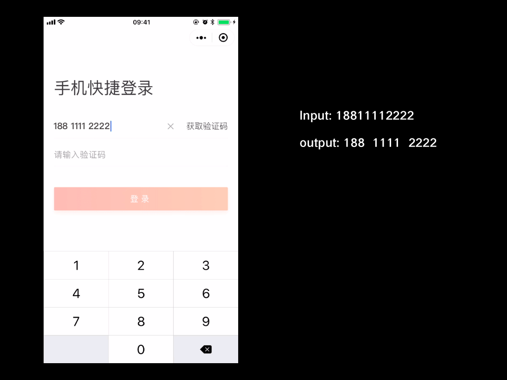
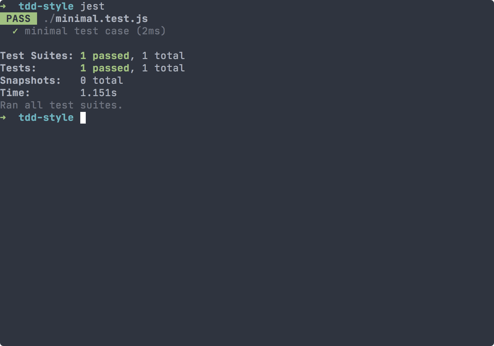
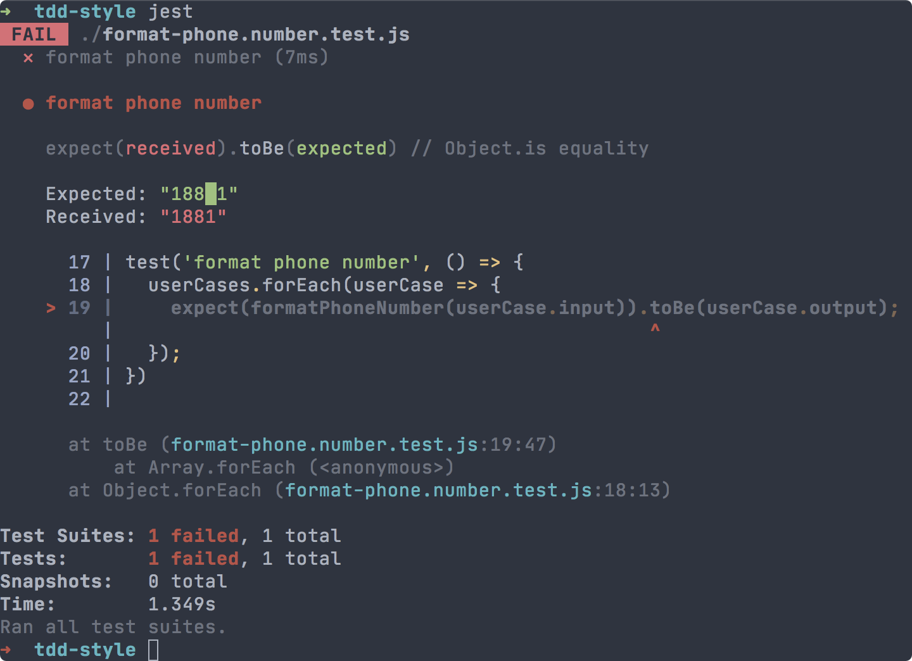
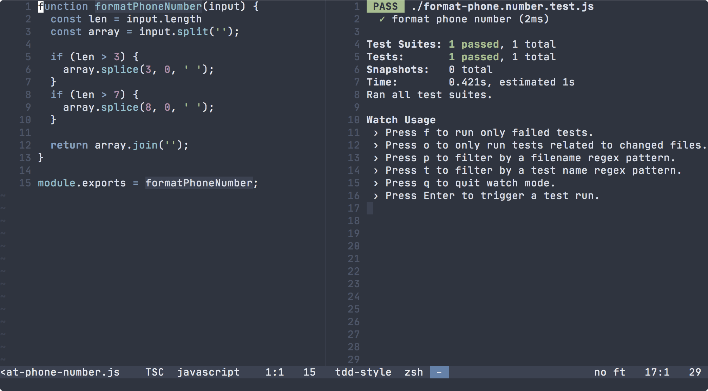

  > 根据我自己 2018 年入职新公司后在团队内部第一次分享内容整理。

## 实际案例需求

  当用户在登录表单输入手机号时，为用户实时将手机号进行格式化：在网络识别号和地区
  编码、地区编码和序号之间插入空格。

  ```
  网络识别号_地区编码_序号
  188_1111_2222
  ```

  


## 需求分析

  需求本身并不复杂，但容易忽略「实时」这个需求要点。这里「实时」的含义是指当用户
  输入到地区编码的第一位数字时，即要在该数字前插入空格，删除该数字时，同时删除空
  格，地区编码和序号之间的空格同理。根据需求可以编写出测试用例：

  ```js
  const cases = [
    { input: '1', output: '1' },
    { input: '18', output: '18' },
    { input: '188', output: '188' },
    { input: '1881', output: '188 1' },
    { input: '18811', output: '188 11' },
    { input: '188111', output: '188 111' },
    { input: '1881111', output: '188 1111' },
    { input: '18811112', output: '188 1111 2' },
    { input: '188111122', output: '188 1111 22' },
    { input: '1881111222', output: '188 1111 222' },
    { input: '18811112222', output: '188 1111 2222' },
  ];
  ```

## Jest 一分钟入门

  1. 安装 Jest: `npm install -g jest`
  2. 在目录下创建 Jest 配置文件：`touch jest.config.js`
  3. 编写一个最小单元测试：

```js
// file: minimal.test.js
test('minimal test case', () => {
  expect(1).toBe(1);
});
```

  4. 运行 `jest`


 

## 编写测试用例

  ```shell
  # 文件目录
  .
  ├── format-phone-number.js
  ├── format-phone.number.test.js
  └── jest.config.js

  0 directories, 3 files
  ```

  ```js
  // format-phone-number.js
  module.exports = function formatPhoneNumber(input) {
    return input;
  }
  ```

  ```js
  // format-phone-number.test.js
  const formatPhoneNumber = require('./format-phone-number');
  const userCases = [
    { input: '1', output: '1' },
    { input: '18', output: '18' },
    { input: '188', output: '188' },
    { input: '1881', output: '188 1' },
    { input: '18811', output: '188 11' },
    { input: '188111', output: '188 111' },
    { input: '1881111', output: '188 1111' },
    { input: '18811112', output: '188 1111 2' },
    { input: '188111122', output: '188 1111 22' },
    { input: '1881111222', output: '188 1111 222' },
    { input: '18811112222', output: '188 1111 2222' },
  ];


  test('format phone number', () => {
    userCases.forEach(userCase => {
      expect(formatPhoneNumber(userCase.input)).toBe(userCase.output);
    });
  });
  ```

  此时可以尝试执行 jest，观察失败的输出结果：

  


## 函数实现

### 方案一：插入空格

  这是可能是最容易想到的方案，但是 JavaScript 中 String 类型总是不可变的，就需要
  按字符分割成数组，然后根据条件在对应的位置使用 `splice` 插入空格：

  ```js
    module.exports = function formatPhoneNumber(input) {
      const len = input.length;

      if (len <= 3) {
        return input;
      }

      const array = input.split('');

      if (len > 3) {
        array.splice(3, 0, ' ');
      }
      if (len > 7) {
        array.splice(8, 0, ' ');
      }

      return array.join('');
    }
  ```

  再运行 `jest` 一下查看结果。此时我们可以给 `jest` 加入一个参数，当代码修改后，
  可以自动执行。这样只要保存一下文件就可以立刻看到结果反馈。

  ```shell
  jest --watchAll
  ```

  


### 方案二：三段切割

  我们可以利用 `String.prototype.slice()` 根据位置切割后在拼接：

  ```js
  function formatPhoneNumber(input) {
    const s1 = input.slice(0, 3);
    const s2 = input.slice(3, 7);
    const s3 = input.slice(7);

    return `${s1} ${s2} ${s3}`.trim();
  }

module.exports = formatPhoneNumber;
  ```

### 方案三：正则表达式

  在处理文本问题，**正则表达式**应该是首选方案，还是用三段切割后拼接的方法，但使
  用正则表达式可以更轻松。

  ```js
  function formatPhoneNumber(input) {
    return input
      .replace(/^(\d{0,3})(\d{0,4})(\d{0,4})$/, '$1 $2 $3')
      .trim();
  }

  module.exports = formatPhoneNumber;
```

## 总结

  TDD 即「测试驱动开发」。

  代码测试早已经是软件开发过程中非常重要的环节。TDD 更有助于写出符合单一
  职责原则的代码，比如 `formatPhoneNumber` 这样的函数不应该负责手机号码的校验。
  如果一个函数或类承担过多的职责，那么测试覆盖起来会很困难。

  代码测试有助于重构。从方案一到方案三，可以迅速反馈重构的结果是否符合预期。

  项目协同开发代码测试不可或缺。测试代码对阅读源码了解其功能有非常大的帮助。曾经
  在一个项目中看到一个函数 280 行，没有单元测试覆盖。想添加新功能，但实在无法下
  手。
