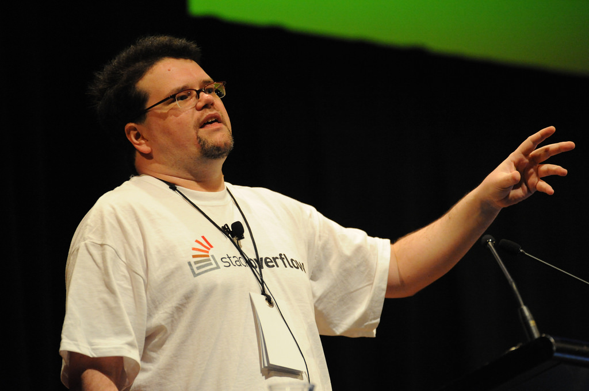
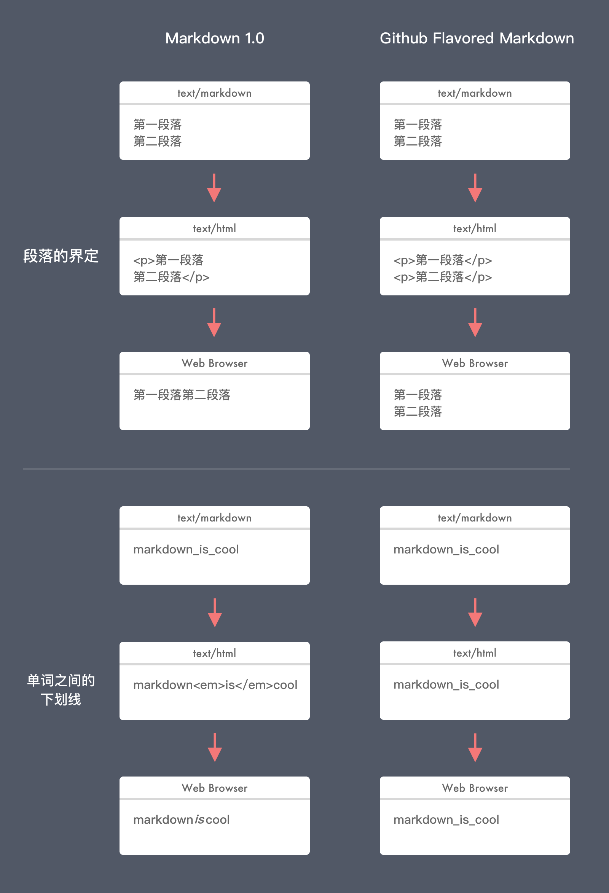

## 主要人物

**[John Gruber](https://daringfireball.net)** 的独立博客一年广告位价格值 300 多
万元。John Gruber 出生于费城，获得了德雷克赛尔大学计算机科学学士学位，曾先后供职
于 [Bare Bones Software](https://www.barebones.com/) 和
[Joyent](https://www.joyent.com/)。John Gruber 在 2002 年创建了个人博客 [Daring
Fireball](https://daringfireball.net/)，核心内容是关于苹果公司的各类信息。为了更
好地进行博客写作，两年后他发布了一个叫 Markdown 的工具。2006 年开始全职经营博客
。他同时主持一档名为 [The Talk Show](https://daringfireball.net/thetalkshow/) 的
播客节目。最近几年的 WWDC 大会期间，The Talk Show 都会邀请到苹果高管进行面对面。
苹果高级副总裁 [Phil Schiller](https://en.wikipedia.org/wiki/Phil_Schiller) 、
[Eddy Cue](https://en.wikipedia.org/wiki/Eddy_Cue) 、 [Craig
Federighi](https://en.wikipedia.org/wiki/Craig_Federighi)，苹果 AR 负责人 Mike
Rockwell，销售主管 Greg Joswiak 在 WWDC 2015 - 2018 期间先后在 The Talk Show 上
亮相。

**[Aaron Swartz](https://en.wikipedia.org/wiki/Aaron_Swartz)** 互联网之子，年少
成名的计算机天才。14 岁参与 RSS 规范设计，[reddit](https://www.reddit.com/) 三位
联合创始人之一。 John Gruber 在 Markdown 项目主页写到：“Aaron Swartz deserves a
tremendous amount of credit for his feedback on the design of Markdown’s
formatting syntax. Markdown is much better thanks to Aaron’s ideas, feedback,
and testing.”。鉴于在年少就有能力参与 RSS 的设计，我们有理由大胆假设 Aaron
Swartz 对 Markdown 语法制定有至关重要的贡献。他的黑客行为导致被控诉，最后在 2013
年 1 月自缢，年仅 26 岁。纪录片 [The Story of Aaron Swartz Full
Documentary](https://anonofficial.com/anonymous-the-story-of-aaron-swartz-full-documentary/)
是人们追忆这位天才的最好方式。

**[Jeff Atwood](https://en.wikipedia.org/wiki/Jeff_Atwood)** 软件工程师。先后创
建了著名的编程问答网站 [Stack Overflow](https://stackoverflow.com/) 和开源论坛软
件 [Discourse](https://www.discourse.org/)。前者是程序员解决问题三大件之一，另外
两个是 Google 和 Github；而后者是目前首选的架设论坛的开源软件。Jeff 在 Markdown
发布的同一年开始自己的博客 [Coding Horror](https://blog.codinghorror.com/)。再该
博客中，他表示自己是 Markdown 忠实铁粉，记录了他如何在早期的 Stack Overflow 使用
Markdown 的语法用于书写问题和答案。Discourse 的也是集成 Markdown。

**[John MacFarlane](http://johnmacfarlane.net/)** 加州大学伯克利分校哲学教授，命
令行文档转换工具 [Pandoc](https://github.com/jgm/pandoc) 作者，
[CommonMark](https://github.com/commonmark) 规范主要编写作者。

## 什么是 Markdown？

根据 14 年前 Markdown 创造者 John Gruber 的定义，Markdown 是一个固定文本格式到
HTML 的转换工具。Markdown 包含了两个内容：

1. 事先约定好的一套纯文本的格式，比如，在一行的开头用什么符号来表示这一行的文字
   是一个大标题；
2. 把遵循 Markdown 语法的文本转换为网页浏览器可以正确渲染的 HTML 的工具。

设计 Markdown 最主要目的，是为了更好地编辑和更高的可读性。针对那些要发布在网络上
的文档来说，如果需要做到结构清晰段落分明，最终都是需要转化为 HTML 格式。而书写大
段的 HTML 内容绝对是糟糕的体验。Markdown 用尽可能简洁的语法格式，达到了这个目的
。

## 2004 - Markdown 的起源

John Gruber 在 2002 年创建了 [Daring Fireball](https://daringfireball.net)。两年
后的 2004 年 3月，发表了第一篇关于 Markdown 文章 [Daring Fireball: Introducing
Markdown](https://daringfireball.net/2004/03/introducing_markdown)，开始公开测试
Markdown。同年 8 月正式发布 Markdown 1.0。在 2004 年 12 月更新到 1.0.1 版本，修
复了一些缺陷。同时把 license 由 1.0 版本的 GPL 修改为更宽松的 BSD-style license
。 自此，John Gruber 再也没有更新过 Markdown ，不论是用 Perl 编写用于转换为 HTML
的工具，还是 Markdown 的语法规则。John Gruber 在 [Daring Fireball: Dive Into
Markdown](https://daringfireball.net/2004/03/dive_into_markdown) 中写到在还没有
Markdown 的当年，用 BBEdit 编辑和预览 HTML 并拷贝到 [Movable
Type](https://movabletype.com/) 发布的不愉快经历。这种不爽的体验促使他做出改变，
才有了 Markdown 的诞生。在 Markdown 的语法制定过程中，John Gruber 获得一个非常耀
眼的计算机天才 [Aaron
Swartz](https://zh.wikipedia.org/wiki/%E4%BA%9A%E4%BC%A6%C2%B7%E6%96%AF%E6%B2%83%E8%8C%A8)
的帮助。

## 2007 - Pandoc

[Pandoc](http://pandoc.org/index.html) 是 John MacFarlane 开发的一款万能文档转换
工具。Pandoc 可以在几十种文档格式之间相互转换。Pandoc 早期就加入对 Markdown 格式
的支持。这使得会有更多早期的用户尝试 Markdown 工具写作。

## 2008 - Stack Overflow

2008 年，[Stack Overflow](https://stackoverflow.com/) 的联合创始人 [Jeff
Atwood](https://blog.codinghorror.com/about-me/) 选定 Markdown 作为 Stack
Overflow 用户编写和回答问题的语法方案。经过一年半的实践，Jeff Atwood 在
[Responsible Open Source Code
Parenting](https://blog.codinghorror.com/responsible-open-source-code-parenting/)
说到：

> I'm a big fan of John Gruber's Markdown. When it comes to humane markup
> languages for the web, I don't think anyone's quite nailed it like Mr. Gruber.
> His philosophy was clear from the outset.  我是 Markdown 的忠实铁粉。说到网页
> 人性化的标记语言时，我认为没有人可以像 Gruber 先生那样优秀。在一开始他的思路就
> 非常明确。  

> With a year and a half of real world Markdown experience under our belts on
> Stack Overflow, we've been quite happy. **I'd say that Markdown is the worst
> form of markup except for all the other forms of markup that I've tried.**
> Stack Overflow 线上使用 Markdown 一年半之后，我们感到相当满意。我必须得说，
> Markdown 是最糟糕的标记形式，除了其他所有我已经试过的。

> On 15 Mar 2008, at 02:55, John Gruber wrote:  I despise what you've done with
> Text::Markdown, which is to more or less make it an alias for MultiMarkdown,
> almost every part of which I disagree with in terms of syntax additions.  

John Gruber 对 Markdown 社区的态度极其冷淡。Jeff Atwood 对此感到非常失望。Jeff
Atwood 是最热心的 Markdown 布道者，用他的影响力不断地向世人阐述使用 Markdown 的
好处。  同时 Jeff Atwood 埋怨 John Gruber 对 Markdown 的发展毫不关心。因 Stack
Overflow 的影响力，Markdown 逐渐开始在程序员的世界里流行起来。

## 2009 - Github Flavored Markdown

Github 大约在 2009 年开始使用 Markdown 1.0 的派生版本 [GitHub Flavored Markdown
(GFM)](http://github.github.com/github-flavored-markdown/)。其中最主要区别在于以
下两点：

1. 段落换行的界定：Github 认为一个换行符（回车键）即为新起一个段落更符合人们的预
期。Markdown 1.0 则需要一行空白行（两个回车键）。我深刻理解 Github 的努力，因为
我第一次使用 Stack Overflow 时也为此感到困惑过。
2. 下划线用来分割多个单词表示一个整体时，不应该处理为斜体。

## 2012 - who’s with me?

Jeff 在 [The Future of
Markdown](https://blog.codinghorror.com/the-future-of-markdown/) 中提议 Stack
Exchange、GitHub、Meteor 和 Reddit 等其他有一定访问量的网站一起努力制定出
Markdown 标准规范和用于测试 Markdown 实现的标准测试用例。Jeff 希望这个标准规范主
要内容包含：

1. 把 John Gruber 的 Markdown 文档用正式的语言规范进行标准化；
2. 提供三个可选项，且给予更稳妥的默认值：a) 默认关闭在单词内部的强调标记；b) 默
   认打开自动添加超链接；c) 默认打开回车键即换行；
3. 验证 Markdown 实现的一组测试用例；
4. 对 Markdown 中存在边界模糊的情况进行清理和调整；
5. 对 Markdown 不同流行版本的处理。

Jeff 便在这个时候开始组建工作小组，成员列表如下：

* John MacFarlane, jgm@berkeley.edu
* David Greenspan, david@meteor.com
* Vicent Marti, vicent@github.com
* Neil Williams, neil@reddit.com
* Benjamin Dumke-von der Ehe, ben@stackexchange.com
* Jeff Atwood, jatwood@codinghorror.com

## 2014 - Standard Markdown & CommonMark

Jeff 所组建的工作小组经过两年的努力，在 2014 年 9 月发布名为 [Standard
Markdown](http://standardmarkdown.com/) 的项目。因 John Gruber [反对这个名称
](https://blog.codinghorror.com/standard-markdown-is-now-common-markdown/)，Jeff
将这个项目名称修改为 [CommonMark](http://commonmark.org/)。CommonMark 规范主要由
Pandoc 的作者 John MacFarlane 编写，其中包含了 624 个测试用例，C 和 JavaScript
的规范实现。

## 2016 - text/markdown

互联网技术标准制定机构 IETF 发布 [RFC 7763 - The text/markdown Media
Type](https://tools.ietf.org/html/rfc7763) 和 [RFC 7764 - Guidance on
Markdown](https://tools.ietf.org/html/rfc7764) 两份征求意见稿，收录 Markdown 格
式作为互联网媒体标准格式 text/markdown。同时为了区分不同 Markdown 版本，提供一个
可选参数 variant=Identifer。RFC7764 中收录了不同 Markdown 版本 Identifier 的值，
同时指出不同版本之间的区别：

1. `text/markdown`  或 `text/markdown; variant=Original` John Gruber 发布的最原
始版本；
2. `text/markdown; variant=MultiMarkdown` MultiMarkdown；
3. `text/markdown; variant=GFM` GitHub Flavored Markdown；
4. `text/markdown; variant=pandoc` Pandoc；
5. `text/markdown; variant=Fountain` Fountain；
6.  `text/markdown; variant=CommonMark` CommonMark；
7.  `text/markdown; variant=kramdown-rfc2629` Markdown for RFCs；
8.  `text/markdown; variant=rfc7328` Pandoc2rfc；
9.  `text/markdown; variant=Extra` PHP Markdown Extra。

## 2017 - GitHub Flavored Markdown Spec

GitHub Flavored Markdown 基于 CommonMark Spec 发布了自己 spec，支持表格、任务列
表和删除线，禁止 HTML 原始标签。测试用例从 624 个增加到 651 个。

## 现在

Markdown 已经是事实上的无处不在。也是诸多笔记和写作软件首选支持的格式。John
Gruber 为了方便更新他的博客，发布了 Markdown。但在此后的 10 多年里，他再也没有更
新 Markdown，他的博客里在这之后也几乎看不到关于 Markdown 的只言片语。而另外一个
人，却十年如一日地爱着 Markdown，在他的 Stack Overflow 和 Discourse 中使用
Markdown，并长期有组织地推广 Markdown。我们记住 Markdown 的创造者 John Gruber 的
同时，也一并铭记 Jeff Atwood 为 Markdown 做出的巨大努力。

参考链接：

* [Daring Fireball](https://daringfireball.net)
* [John Gruber - Wikipedia](https://en.wikipedia.org/wiki/John_Gruber)
* [Aaron Swartz - Wikipedia](https://en.wikipedia.org/wiki/Aaron_Swartz)
* [Jeff Atwood - Wikipedia](https://en.wikipedia.org/wiki/Jeff_Atwood)
* [A strongly defined, highly compatible specification of
  Markdown](https://commonmark.org)
* [Markdown - Wikipedia](https://en.wikipedia.org/wiki/Markdown)
* [Markdown (Aaron Swartz: The Weblog)](http://www.aaronsw.com/weblog/001189)
* [The Markdown Movement](http://aaronbeveridge.com/markdown/index.html)
* [RSS Creator and Reddit cofounder Aaron Swartz dead at 26 | Harvard
  Magazine](https://harvardmagazine.com/2013/01/rss-creator-aaron-swartz-dead-at-26)
* [Is HTML a Humane Markup
  Language?](https://blog.codinghorror.com/is-html-a-humane-markup-language/)
* [Responsible Open Source Code
  Parenting](https://blog.codinghorror.com/responsible-open-source-code-parenting/)
* [Standard Flavored
  Markdown](https://blog.codinghorror.com/standard-flavored-markdown/)
* [Standard Markdown is now Common
  Markdown](https://blog.codinghorror.com/standard-markdown-is-now-common-markdown/)
* [The Future of
  Markdown](https://blog.codinghorror.com/the-future-of-markdown/)
* [Greg Joswiak & AR head Mike Rockwell join John Gruber to talk iOS 12, iOS
  apps on macOS, more -
  9to5Mac](https://9to5mac.com/2018/06/05/wwdc-joswiak-rockwell-talk-show-interview/)
